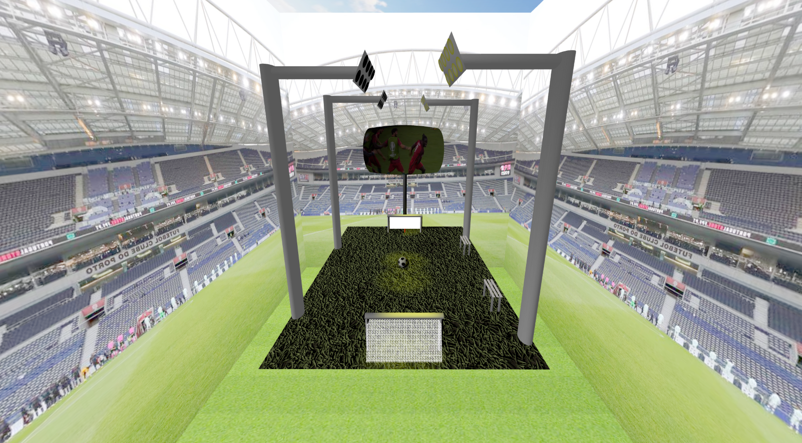
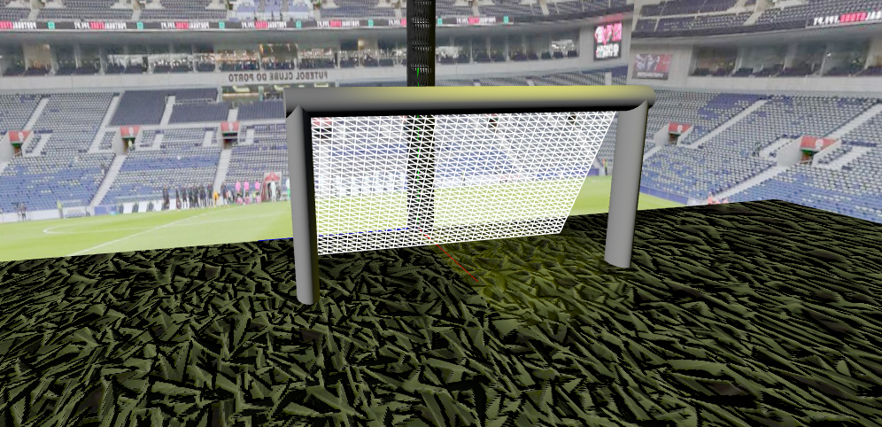
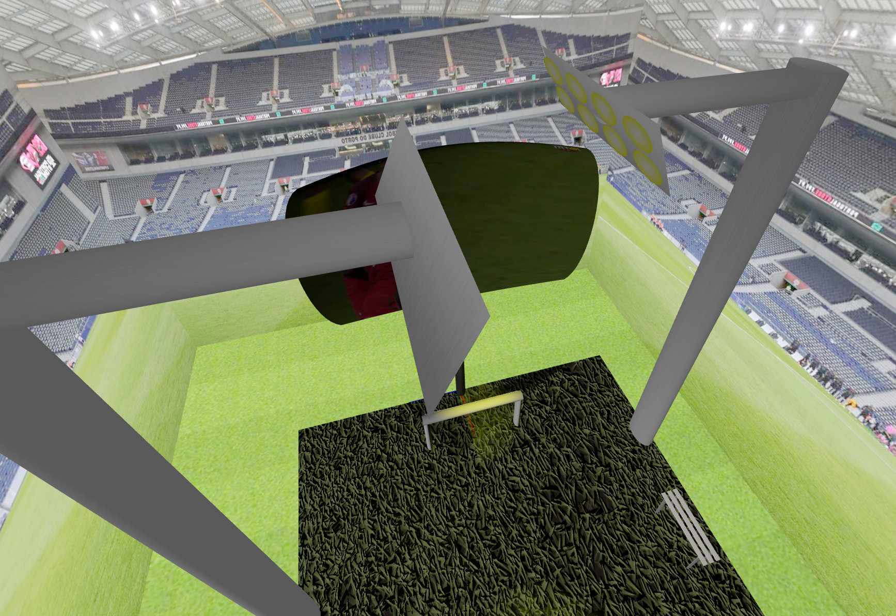
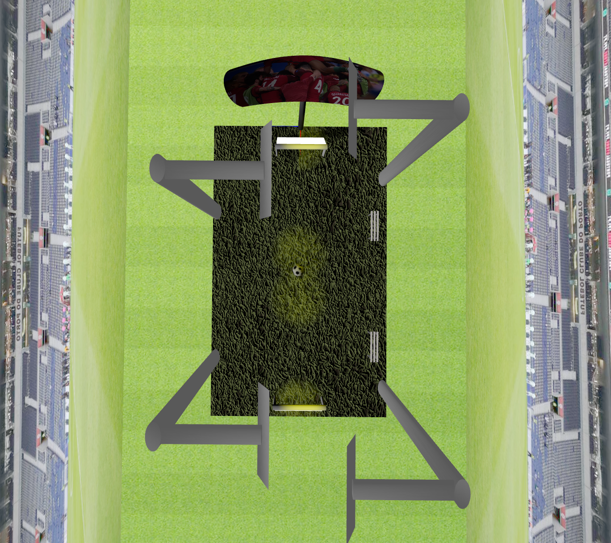

# SGI 2023/2024 - TP1

## Group T06G02

| Name             | Number    | E-Mail                   |
| ---------------- | --------- | ------------------------ |
| Afonso Pinto     | 202008014 | up202008014@edu.fe.up.pt |
| Inês Oliveira    | 202103343 | up202103343@edu.fe.up.pt |

----
## Project information

In this project, we tried to recreate Estádio do Dragão. We have a football field, where we applied advanced textures. We have benches for the players that didn't start. We also added two goals, using wireframes to imitate their nets, and a ball, which is a sphere with a texture. 
Our stadium is surrounded by a skybox, composed by a football fiels and the stands of the best stadium in the world (Estádio do Dragão). 
Equipped with best multimedia center in the world, we have a big curved screen (using nurbs), showing the most important moment in the history of Mankind: <b>Eder's goal</b>. We also invested in a state of the art light system, with 4 spotlights (composed of 8 polygons each).
Beyond that, we have the necessary lights the scene needs, as well as the cameras implemented in the demo scene.

## Screenshots

Here are some screenshots of the scene:

## Issues/Problems

We found designing and implementing nurbs somewhat difficult.