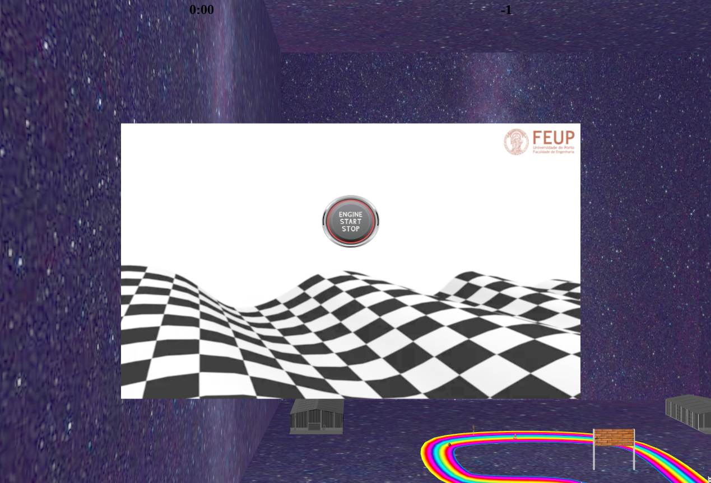
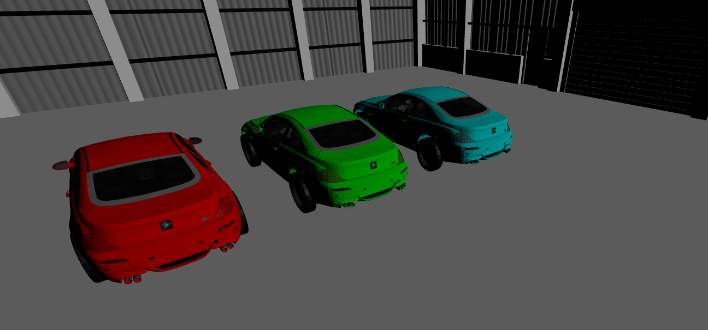
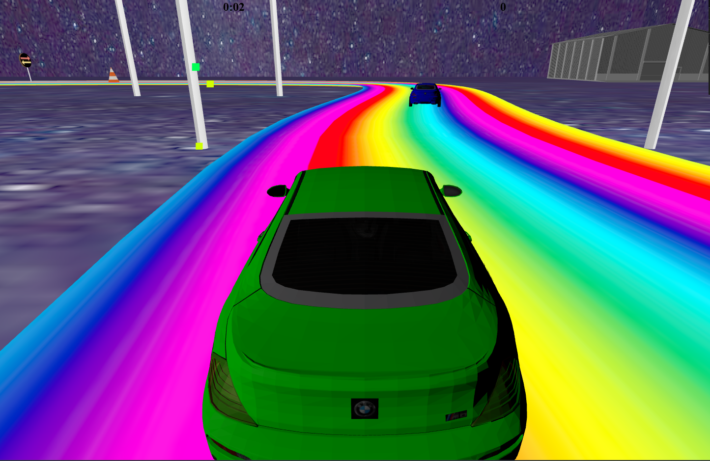
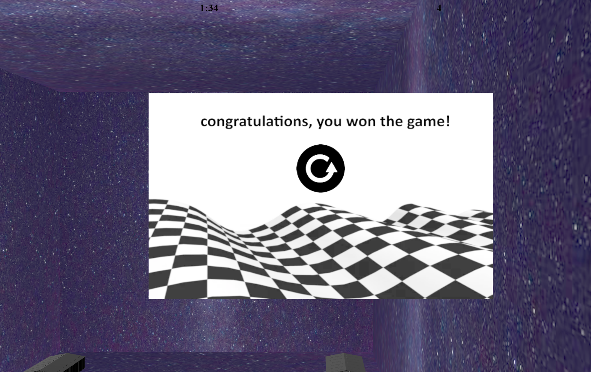

# SGI 2023/2024 - TP3

## Group: T06G02

| Name             | Number    | E-Mail                   |
| ---------------- | --------- | ------------------       |
| Afonso Pinto     | 202008014 | up202008014@fe.up.pt     |
| Inês Oliveira    | 202103343 | up202103343@fe.up.pt     |

----
## Project information

In our project, we developed an engaging car racing game with dynamic gameplay features and immersive 3D graphics. Key elements of the game include:

### Key Features

1. **Dynamic Camera Movement**: A camera that consistently follows the car, providing a seamless racing experience.
2. **Realistic Car Mechanics**: The car features an acceleration factor, ensuring it doesn't reach maximum velocity instantly. Additionally, the car slows down by 0.6 times its speed when off-track.
3. **Power-Ups**:
   - **Mushroom Model**: Temporarily doubles the car's speed for 5 seconds.
   - **Clock Model**: Reduces the race time by 5 seconds.
4. **Obstacles**:
   - **Traffic Cone**: Reduces car's speed by 0.5 for 3 seconds.
   - **Road Sign**: Inverts the horizontal controls for 5 seconds (A for right, D for left).
5. **Outdoor Displays**: Show real-time information like lap number, car speed, elapsed time, and game status (paused/playing).
6. **AI Rival**: The player races against an AI car with adjustable speed to modify difficulty. Collisions with the AI car halve the player's speed for 3 seconds.
7. **Garages and Scenery**:
   - Two garages for selecting player and rival cars.
   - A 3D model of a house, initially planned for choosing obstacles.
8. **Advanced Graphics**:
   - Outdoor display with a texture and bump map.
   - Custom shader for adding depth and a 3D effect using the bump map.
9. **Game States and UI**:
   - Starting menu, game-over screen, and pause state.
   - Heads-Up Display (HUD) for time tracking and lap counting.
10. **Celebratory Fireworks**: Triggered upon winning a race, adding to the excitement.

This comprehensive setup ensures a thrilling and visually stimulating racing experience, combining classic gameplay mechanics with innovative graphical enhancements.

----

## Issues/Problems

The picking system, as well as the shader of the outdoor display, gave us particular trouble.

## Screenshots

Here are some screenshots of the scene:

